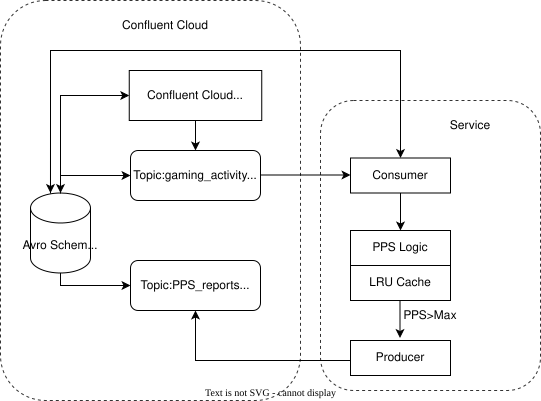

# Confluent Cloud Kafka PPS abnormality flagging

This tiny microservice ingests generated gaming player activity -> determines PPS (Points per second) -> flags, and logs events if the preset limit is exceeded

This microservice was built and run utilizing Confluent Cloud, Confluent Kafka, Java, Gradle, and Avro Schemas.

## System Diagram

All rights reserved. Permission is granted to view the contents of this repository. No permission is granted to use, copy, modify, or redistribute any portion.
